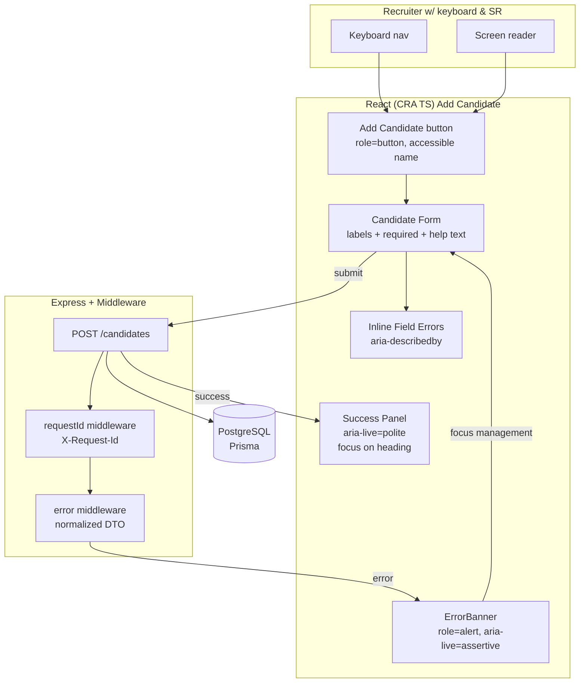

# Design — Accessibility & Responsiveness for "Add Candidate"

Phase: 1 (Design Doc)
Owner: Recruiting Platform Team
Date: 2025-10-26

## Overview & Goals

This design ensures the Add Candidate flow (entry point, form, and feedback) is accessible to keyboard and screen reader users and remains usable from ≥320px mobile screens to desktop widths. It aligns with WCAG 2.1 AA, existing error-handling, and our React/Express stack.

Goals
- WCAG 2.1 AA compliance for the Add Candidate experience.
- Robust keyboard navigation, focus management, and semantic labeling.
- ARIA announcements for errors and success.
- Responsive layout without loss of content/functionality at ≥320px.
- Verified on latest Chrome, Edge, Firefox, Safari (last 2 versions).

Non‑Goals
- Global application a11y overhaul; scope is limited to Add Candidate.
- Visual redesign beyond minimum needed for conformance.

Assumptions
- Frontend uses CRA + TypeScript with CSS stylesheets (`App.css`, `index.css`).
- Error handling is centralized (ErrorBanner), and backend emits normalized DTOs with `X-Request-Id`.

## Architecture (Mermaid)

## UI & Interaction Design

Landmarks & Structure
- Ensure a main landmark wraps the form (`<main>`), with a page `<h1>`. Consider a `<section>` for the success panel.
- Provide a skip link to main where applicable (optional if global layout already includes it).

Labels & Help
- Use `<label for>` or `aria-labelledby` for all inputs. Include required status in visual text (e.g., “First Name (required)”) and programmatically (`aria-required="true"` or use native `required`).
- Provide examples for Email and Phone via help text tied with `aria-describedby`.

Validation & Errors
- Client rules: required fields, email format, CV file type/size. On blur or submit, associate error text with input via `aria-describedby`.
- Use a single, consistent error banner for non-field errors: `role="alert"`, optionally `aria-live="assertive"`.
- Keep field-level errors inline and concise; do not duplicate messages between banner and inline.

Focus Management
- On navigation to form: move initial focus to page `<h1>` or form legend to announce context.
- On submit success: move focus to the success container’s heading.
- On submit error: move focus to the first invalid field or the error banner (choose one; prefer first invalid field for forms).
- Ensure all interactive elements show visible focus (use CSS outline; avoid removal).

Keyboard Interactions
- All controls reachable via Tab/Shift+Tab; no keyboard traps.
- File input is focusable and has an accessible name; message constraints in nearby text.

Responsive Behavior
- Small screens (≥320px):
	- Single-column layout; avoid horizontal scrolling in core content.
	- Touch targets ~44×44 px where possible.
- Medium/large screens: two-column form sections may be used where appropriate, but preserve reading order.
- Use CSS media queries; do not rely on pixel-perfect assumptions.

Contrast & States
- Verify text/background contrast ≥4.5:1 (normal text). Ensure hover/focus states meet contrast guidance.

Announcements
- Success: container with `aria-live="polite"` and semantic heading.
- Errors: inline (`aria-describedby`) + optional banner `role="alert"` for request-wide failures.

## Tech Stack & Decisions

- React (CRA + TS), React Testing Library, Jest. Optional: `axe-core` via `jest-axe` for automated a11y checks.
- Plain CSS with media queries in `App.css`/component CSS; avoid additional libraries unless necessary.
- Keep DOM semantic; use ARIA only when semantics cannot be expressed with native elements.

## Data Models / APIs

- No schema changes. Accessibility does not alter the backend data model.
- Reaffirmed error DTO includes `requestId`; frontend maps to `AppError` and surfaces via ErrorBanner.

## Testing Strategy

Automated
- Unit: render form, labels/roles present, required indicators, tab order basics (as feasible).
- a11y: `jest-axe` on key screens/components (Form, ErrorBanner, Success Panel) with negative tests for common violations.
- Integration: mock API responses (success/error) to verify focus movement and announcements.

Manual
- Screen readers: NVDA/JAWS (Windows) and VoiceOver (macOS) basic pass for form flow.
- Keyboard-only navigation from entry point to success.
- Responsive checks at 320px, 375px, 768px, ≥1024px.

## Non‑Functional Requirements

- Compatibility: Latest two versions of Chrome, Edge, Firefox, Safari.
- Performance: No regressions; announcements and focus changes are instantaneous.
- Observability: Preserve `X-Request-Id`; never log PII in client.

## Risks & Mitigations

- Risk: Hidden regressions from CSS changes → Mitigate with visual checks + a11y tests.
- Risk: Overuse of ARIA where semantics suffice → Prefer semantic HTML; review changes.
- Risk: Conflicting focus handling → Single source of truth for focus changes within form submit handler.

## Rollout & Acceptance

- Behind-the-scenes change; no new external API contracts.
- Acceptance demo: keyboard and screen reader flow from entry → form → success; responsive snapshots at key breakpoints; automated a11y checks passing.

---

When ready, approve with `/approve design` to proceed to Phase 2 (Task Breakdown).
