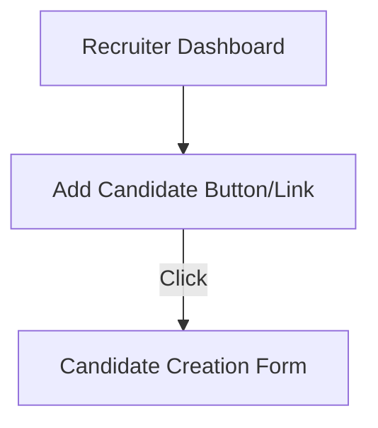

# Design Doc: Add Candidate Entry Point

## Overview & Goals
Enable recruiters to easily initiate the candidate creation workflow from the dashboard via a clear, accessible entry point. The entry point should be prominent, meet accessibility standards, and launch the candidate form without a full page reload.

## Architecture

## Tech Stack & Decisions
- Frontend: React (TypeScript)
- UI Library: Existing design system or accessible HTML/CSS
- Routing: Client-side navigation (React Router or modal)
- Accessibility: WCAG 2.1 AA compliance (contrast, focus, ARIA)

## Data Models / APIs
- No direct backend API for entry point; triggers frontend navigation to candidate form.
- Candidate form will POST to `/api/candidates` (handled in separate feature).

## Non-Functional Requirements
- Accessibility: Button/link meets WCAG 2.1 AA (contrast, focus, ARIA labels)
- Performance: Entry point renders within 1s
- Responsiveness: Works on desktop, tablet, mobile
- Compatibility: Chrome, Edge, Firefox, Safari (last 2 versions)
