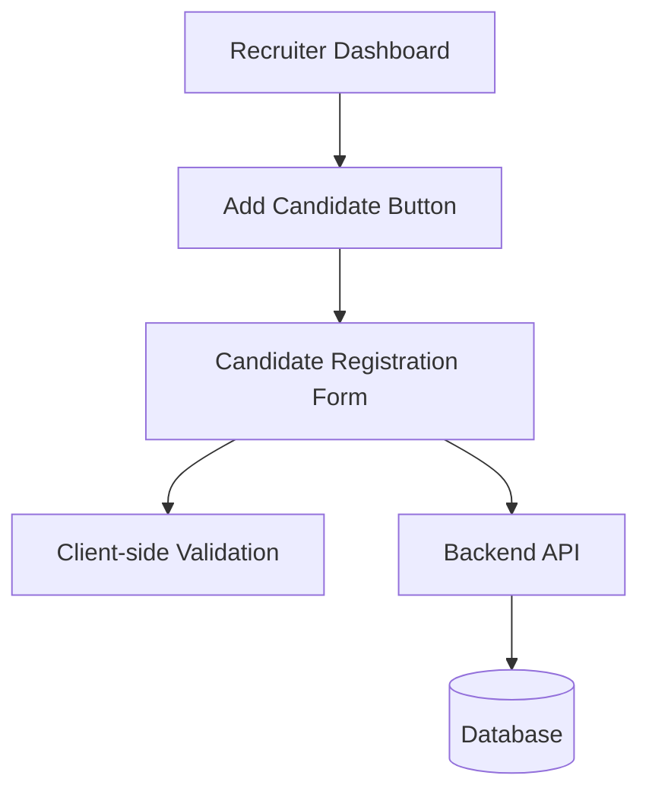

# Design Doc: Candidate Registration Form

## 1. Overview & Goals
The Candidate Registration Form enables recruiters to add new candidates to the ATS with all required personal and professional details. The form enforces validation, provides user guidance, and ensures accessibility and responsiveness.

## 2. Architecture (Mermaid)

## 3. Tech Stack & Decisions
- Frontend: React (TypeScript)
- Validation: HTML5 + custom logic (Yup or custom)
- Accessibility: ARIA, WCAG 2.1 AA compliance
- Responsive design: CSS Flex/Grid
- Backend: Node.js/Express (TypeScript)
- Data persistence: Prisma ORM (PostgreSQL)

## 4. Data Model
- Candidate
  - firstName: string (required)
  - lastName: string (required)
  - email: string (required, valid format)
  - phone: string (required), valid format)
  - address: string (required)
  - education: string (required)
  - workExperience: string (required)

## 5. API Endpoints
- `POST /api/candidates`
  - Request: JSON body with all required fields
  - Response: Success or error (field-level validation)

## 6. Non-Functional Requirements
- Accessibility: WCAG 2.1 AA for forms, labels, navigation, error announcements
- Responsiveness: ≥320px width, desktop/tablet/mobile
- Performance: Form renders <1s, submit <2s p95
- Compatibility: Chrome, Edge, Firefox, Safari (last 2 versions)
- Observability: Log validation failures, submission outcomes

## 7. Security
- PII protection: HTTPS, role-based access
- Audit trail: Record creator and timestamp

## 8. Edge Cases
- Duplicate email: API returns error, UI suggests viewing existing candidate
- Large text: Fields trimmed/capped, counters if needed
- Connectivity: Preserve unsent form state
