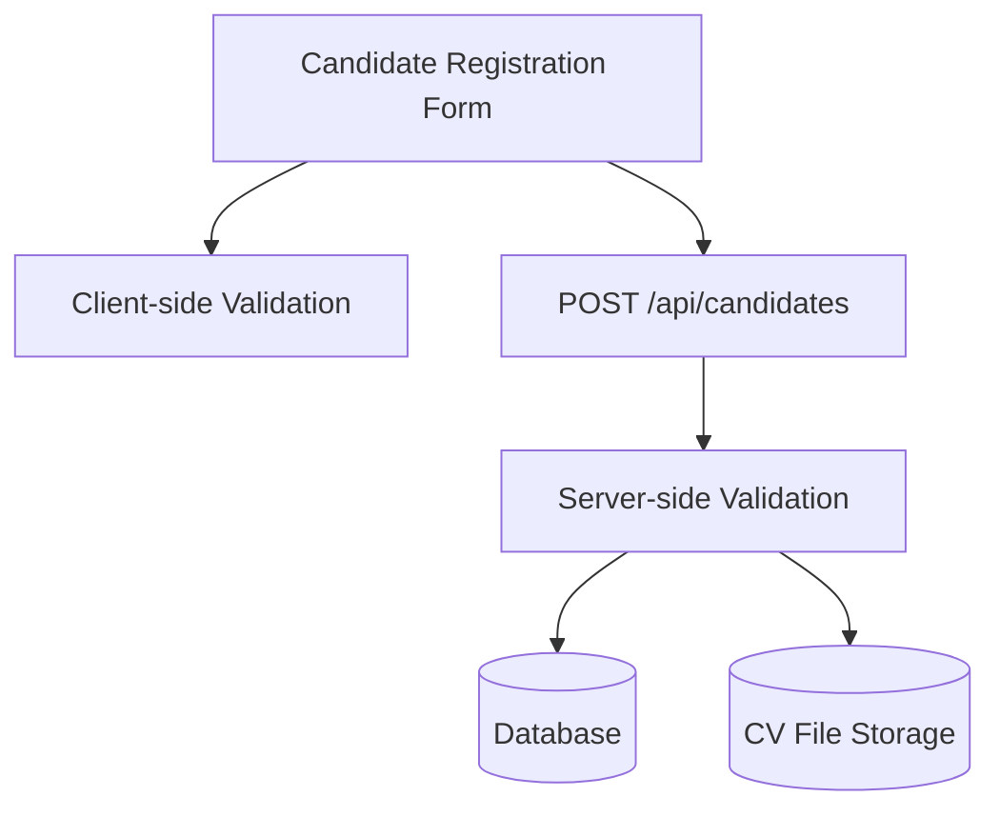

# Design Doc: Candidate Validation

## Overview & Goals
This feature enforces robust validation for candidate registration, covering required fields, email format, and CV file type/size. Validation is performed on both client and server, with actionable feedback mapped to form fields.

## Architecture (Mermaid)

## Tech Stack & Decisions
- Frontend: React (TypeScript), HTML5 validation, custom logic (Yup or custom)
- Backend: Node.js/Express (TypeScript), input schema validation (e.g., Zod, Joi)
- File validation: MIME type and extension checks, max size enforced client/server
- Automated tests: Jest (unit/integration)

## Validation Logic
- Required fields: firstName, lastName, email, phone, address, education, workExperience
- Email: must match valid format (regex)
- CV file: must be PDF/DOCX, ≤ 5 MB (checked before upload and on server)
- Errors: mapped to fields; non-field errors shown in toast/banner
- Server returns structured error responses for all validation failures

## Data Flow
1. User fills candidate form; client validates required fields, email, CV file type/size
2. On submit, data sent to backend API
3. Server validates all fields and file again
4. On success: candidate record created, CV stored, confirmation shown
5. On error: structured error response mapped to UI

## Non-Functional Requirements
- Accessibility: Error feedback announced via ARIA; form controls labeled
- Performance: Validation runs instantly; submission completes ≤2s p95
- Security: File uploads checked for type/size; PII protected
- Compatibility: Works on modern browsers, responsive design

## Decisions & Open Questions
- Use Yup (frontend) and Zod/Joi (backend) for schema validation
- File storage: object storage preferred for CVs
- Email uniqueness enforced at creation
